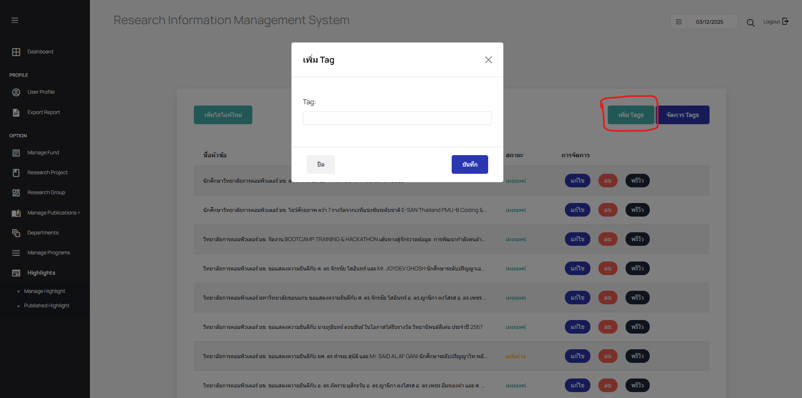
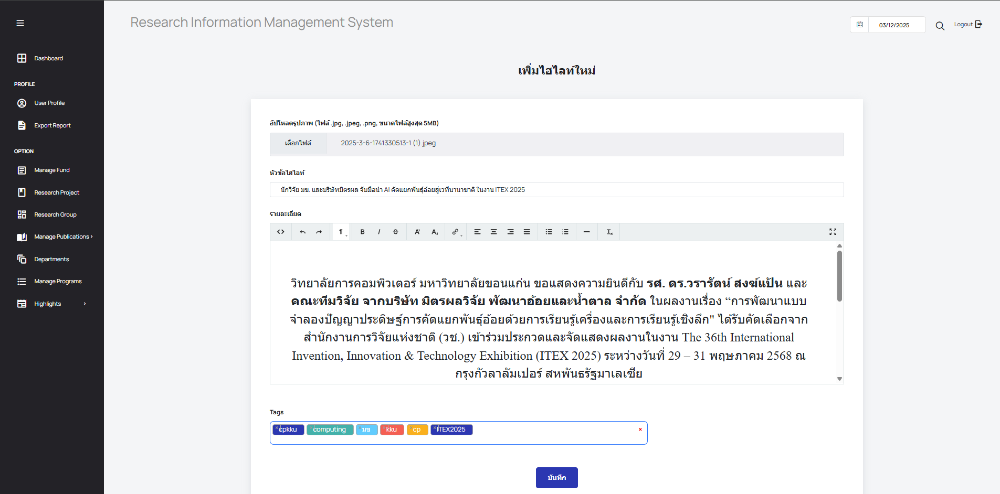
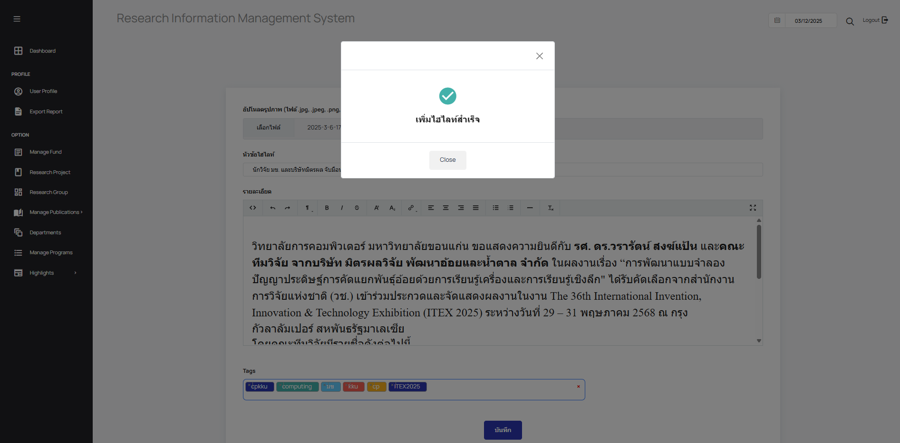
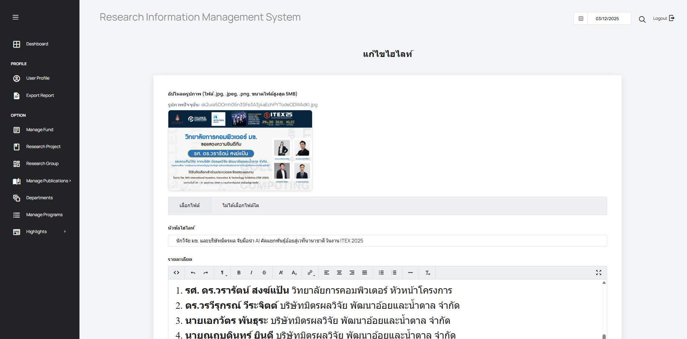
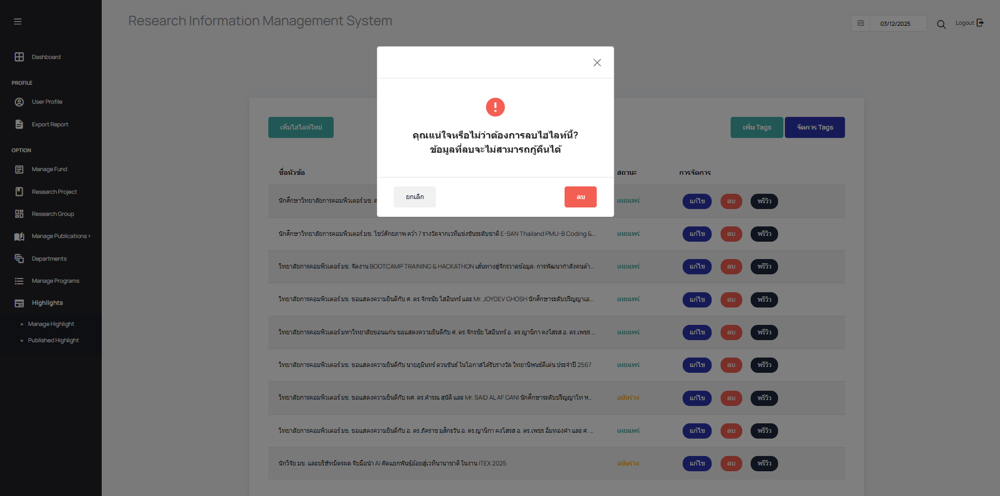
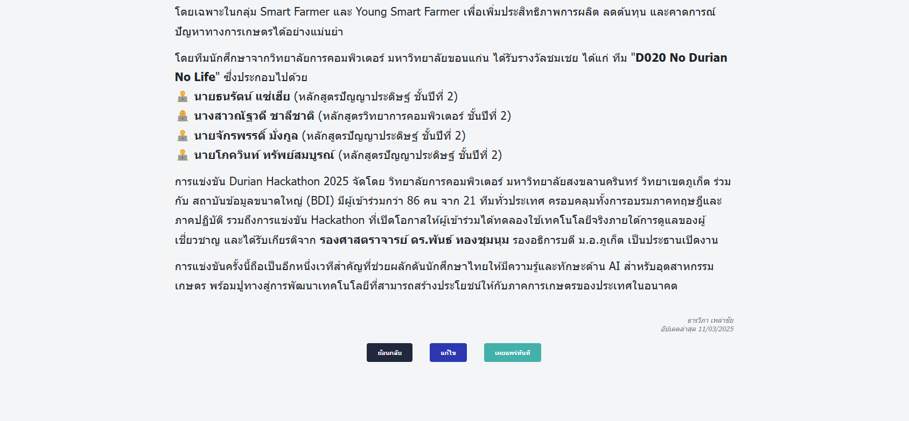
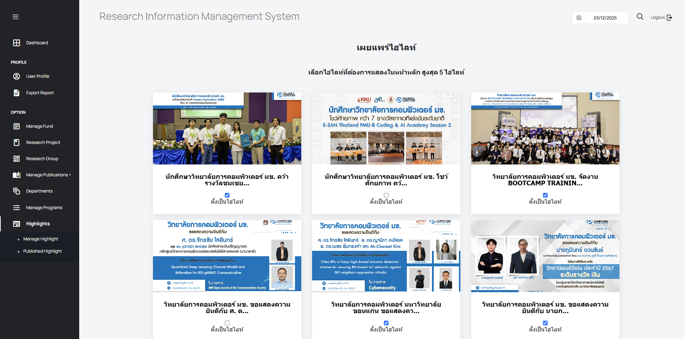

# **คู่มือการใช้งาน (User Manual)**

### **ระบบ: Research Document Management System**

**เวอร์ชัน:** 1.2\
**วันที่อัปเดตล่าสุด:** 11/3/2568\
ผู้พัฒนา: กลุ่ม4

---

## **1. บทนำ (Introduction)**

ระบบ **Research Document Management System** เป็นแพลตฟอร์มที่ช่วยบริหารจัดการเอกสารงานวิจัยของวิทยาลัยการคอมพิวเตอร์ โดยรองรับการแสดงข้อมูลเกี่ยวกับนักวิจัย โครงการวิจัย กลุ่มวิจัย และรายงานต่างๆ พร้อมทั้ง **กราฟแสดงจำนวนผลงานวิจัย** ที่ดึงข้อมูลจากฐานข้อมูลภายนอก เช่น **Google Scholar, SCOPUS, WOS และ TCI**

### **ปัญหาที่ได้รับการแก้ไขหรือคุณสมบัติที่เพิ่มเติมในเวอร์ชันนี้**

1. **As an administrative staff, I want to present the highlight to all visitors.**
   **ในฐานะเจ้าหน้าที่ดูแลระบบ , ฉันอยากจะนำเสนอไฮไลท์ให้กับผู้เข้าชมทุกท่าน **
   ** สรุปความสำคัญ**
        - สร้างระบบจัดการไฮไลท์(ข่าว) ในส่วนของ  administrative staff เพื่อคัดเลือกนำเสนอข่าวที่กำลังได้รับความนิยมหรือต้องการให้ได้รับความนิยมให้กับผู้ชมทั่วไปที่ไม่ได้ login เข้ามาในระบบหรือผู้ชมที่ต้องการมาเยี่ยมชมหน้าเว็ปไซต์ โดยสามารถเลือกได้มากที่สุด 5 ไฮไลท์
  
        - เพิ่มแบนเนอร์แบบเลื่อนซ้ายขวาสำหรับการแสดงไฮไลท์(ข่าว)ให้กับผู้ชมทั่วไปที่ไม่ได้ login เข้ามาในระบบหรือผู้ชมที่ต้องการมาเยี่ยมชมหน้าเว็ปไซต์ ซึ่งสามารถเห็นได้มากที่สุด 5 ข่าวในหน้าไฮไลท์หลัก แต่ก็ยังสามารถเห็นข่าวอื่นๆได้เมื่อกดที่อ่านเพิ่มเติมของข่าวประชาสัมพันธ์ โดยสามารถคลิกที่รูปเพื่ออ่านข่าวเต็มได้ อีกทั้งได้มีการเพิ่มระบบการค้นหาข่าวทั้งจากชื่อข่าวและชื่อของ Tag ของข่าวเพิ่มเติมเข้ามา
  
    **Administrative staff**
   - ทำการเพิ่มเมนู Highlight ในหน้า Research Information Management System สำหรับ Administrative staff ซึ่งเป็นเมนูสำหรับการจัดการกับไฮไลท์(ข่าว)ที่จะแสดงบนหน้าหลักของเว็ปไซต์ให้กับให้กับผู้ชมทั่วไปที่ไม่ได้ login เข้ามาในระบบหรือผู้ชมที่ต้องการมาเยี่ยมชมหน้าเว็ปไซต์ ซึ่งจะมีเมนูย่อย อีก 2 เมนูคือ
     - Manage Highlight
        สามารถเพิ่ม,แก้ไข,ลบ,ดูพรีวิว สำหรับไฮไลท์(ข่าว)ที่ต้องการแล้วทำการเผยแพร่ไปในหัวข้อ 'ข่าวประชาสัมพันธ์'ของเว็ปไซต์สำหรับ Visitors ได้
     - Published Highlight 
        สามารถทำการ checkbox เพื่อเลือกไฮไลท์(ข่าว)ที่ต้องการนำเสนอในเมนู 'Highlight' ของเว็ปไซต์สำหรับ Visitors
  
    **Visitors**
    - เพิ่มและปรับปรุงหน้าหลักของเว็ปไซต์โดยเพิ่มเมนู 'Highlight' กับแก้ไขเมนู 'ข่าวประชาสัมพันธ์' 
      - เมนู 'Highlight' ซึ่งเป็นเมนู Slideshow นำเสนอข่าวที่น่าสนใจ
      - เมนู 'ข่าวประชาสัมพันธ์' มีการแก้ไขให้สามารถคลิกเข้าไปดูข่าวเมื่อคลิกไปที่รูป , เพิ่มให้สามารถค้นหาข่าวจากชื่อและ Tag ของข่าวได้

---

## **2. ขั้นตอนการใช้งานและตรวจสอบ**

### **2.1 Administrative staff**
**ที่ตั้ง:**

- **หน้าระบบจัดการข้อมูลวิจัยของสาขาวิชาวิทยาการคอมพิวเตอร์ของผู้แลระบบ**
- **การใช้งาน:**
### **2.1.1 ไปหน้า Highlight (administrative staff)**
**เนื้อหา** - การใช้งานการเข้าสู่หน้าการจัดการไฮไลท์ของผู้ดูแลระบบ

1. เข้าหน้า main page แล้วกดปุ่ม login บริเวณมุมบนขวา
   
2. ผู้ดูแลลระบบทำการเข้าสู่หน้า login แล้ว login ด้วย username และ password ของผู้ดูแลระบบ
   
3. เมื่อเข้าระบบสำเร็จจะเข้าสู่หน้าเมนูของผู้ดูแลระบบ เลื่อนลงมาแล้วจะเห็น เมนู 'Highlight' ที่อยู่ล่างสุดทางซ้าย \
   

### **2.1.2 หน้า Manage Highlight (administrative staff)**
**เนื้อหา** - การใช้งานการเข้าสู่หน้า Manage Highlight
4. เมื่อคลิกเพื่อเข้าสู่หน้า Highlight แล้วเข้าเมนู Manage Highlight จะเห็น list ข่าว ซึ่งสามารถเห็นชื่อข่าว , สถานะการเผยแพร่ข่าว , ทำการเพิ่มข่าวใหม่ , แก้ไขข่าว , ลบข่าว , พรีวิวข่าวก่อนเผยแพร่
   
5. สามารถจัดการทั้งเพิ่ม tag ใหม่ และจัดการกับ tag เก่า ได้ 
    
    
6. เมื่อต้องการจะเพิ่มไฮไลท์ใหม่ ให้คลิกที่ 'เพิ่มไฮไลท์' แล้วจะเข้าสู่หน้าเพิ่มไฮไลท์
    
7. สามารถเพื่อรูป , ชื่อข่าว , เนื้อหาข่าว , และ tag จัดหมวดหมู่ข่าวได้ 
   
8.  เมื่อทำการจัดการข้อมูลสำเร็จให้ทำการบันทึก จะมีการแจ้งเตือนว่าเพิ่มไฮไลต์สำเร็จ แล้วจะกลับสู่หน้า Manage Highlight 
    
    

### **2.1.3 แก้ไข Highlight (administrative staff)**
**เนื้อหา** - การใช้งานการแก้ไขไฮไลท์
9.  กรณีต้องการแก้ไข Highlight ให้ทำการกดคลิกที่ปุ่ม 'แก้ไข' เมนูไฮไลท์ แล้วจะเข้าสู่หน้าเมนูแก้ไขซึ่งจะแสดงข้อมูลเก่า
    
10. เมื่อทำการแก้ไขข้อมูลสำเร็จให้ทำการกดปุ่มบันทึกการแก้ไข จะมีการแจ้งเตือนว่าเเก้ไขไฮไลต์สำเร็จ แล้วจะกลับสู่หน้า Manage Highlight 
    

### **2.1.4 ลบ Highlight (administrative staff)**
**เนื้อหา** - การใช้งานการลบไฮไลท์
11. หากต้องการลบ ให้ทำการคลิกที่ปุ่มลบ แล้วจะแสดงหน้าจอเตือนการลบโดยเมื่อกดยืนยันจะทำการลบไฮไลท์ออกแล้วกลับสู่หน้า Manage Highlight 
    
    

### **2.1.5 พรีวิว Highlight (administrative staff)**
**เนื้อหา** - การใช้งานการดูหน้าพรีวิวไฮไลท์
12. เมื่อกดไปที่พรีวิวจะทำการแสดงหน้าพรีวิวข่าวเหมือนที่จะปรากฏบนหน้าเว็ปไซต์ซึ่งสามารถเลือกได้ว่าจะย้อนกลับ สู่หน้าเมนู Manage Highlight , แก้ไข Highlight, เผยแพร่ไฮไลท์ทันที
    
13. เมื่อกดเผยแพร่ไฮไลท์ทันที แล้วย้อนกลับไปที่หน้า Manage Highlight ข่าวที่มีสถานะ ฉบับร่างจะกลายเป็น เผยแพร่ทันที 
    

### **2.1.6 Published Highlight (administrative staff)**
**เนื้อหา** - การใช้งานการเข้าสู่เมนู Published Highlight และแสดงไฮไลท์
14. ใต้เมนู Manage Higlight จะมีเมนู Published Highlight ซึ่งจะเป็นหน้าจอสำหรับการเพิ่มไฮไลท์ในเมนูหลักโดยจะปรากฏ Banner และชื่อของข่าวที่มีในระบบโดยแต่ละข่าวจะมี checkbox ตั้งเป็นไฮไลท์  และปุ่มบันทึกหลัก
    
15. เมื่อทำการ check ที่ checkbox แล้วกดปุ่มบันทึก จะทำการเพิ่มไฮไลท์สู่หน้าเว็ปไซต์หลัก 
    
    หน้าเว็ปไซต์หลักก่อนการเพิ่มไฮไลท์
    

    หน้าเว็ปไซต์หลักหลังการเพิ่มไฮไลท์
    

### **2.2 Visitors**

**ที่ตั้ง:**

- **หน้าหลักของเว็ปเพจคณะ**
- **การใช้งาน:**

### **2.2.1 ดูตรวจสอบ Highlight (visitors) **
**เนื้อหา** - การใช้งานและการอ่านข่าว
1. เข้าสู่หน้าหลักของเว็ปเพจ จะปรากฏไฮไลท์ที่แสดงขึ้นตรงบนกลางจอแสดงให้เห็น
   
2. ผู้ชมสามารถอ่านรายละเอียดของ ไฮไลท์ได้จากการคลิกที่รูปไฮไลท์ หรือคลิกที่เมนู Highlight ด้านบน 
   
   หน้าเมนูที่รวบรวมไฮไลท์ทั้งหมด 
   
   หน้าเมนูอ่านข่าวในส่วนของ visitors 
   

### **2.2.2 เมนูข่าวประชาสัมพันธ์ (visitors) **
**เนื้อหา** - การใช้งานเนื้อหาที่เพิ่มเติม
1. เข้าสู่หน้าหลักของเว็ปเพจ จะปรากฏเมนูข่าวประชาสัมพันธ์ที่แสดงข้างล่างไฮไลท์ที่แสดงขึ้นตรงบนกลางจอให้เห็น ซึ่งจะแสดงทุกข่าวไม่เฉพาะข่าวที่เป็นไฮไลท์
   
2. เมื่อกดอ่านเพิ่มเติม จะเข้าสู่หน้าเมนูที่รวบรวมข่าวประชาสัมพันธ์และไฮไลท์ทั้งหมด 
   
3. สามารถกดหาข่าวได้ทั้งจากการหาชื่อข่าวและ Tag ของข่าว 
   หาผ่านชื่อข่าว
   
   หาผ่าน Tag ข่าว
   

## **3. Impact on User (ผลที่เกิดกับ User)**
## **3.1 Administrative staff **
    - สามารถเพิ่ม , ตรวจสอบ ,แก้ไข ,ลบ ,พรีวิว และเผยแพร่ข่าวเข้าสู่ระบบได้
    - ควบคุมข่าวที่จะแสดงเป็นไฮไลท์ของเว็ปได้
## **3.2 Visitors**
    - สามารถมองเห็นข่าวที่เป็นไฮไลท์ปรากฏบนหน้าจอหลักได้ สามารถกดอ่านข่าวได้จากการคลิกที่ภาพ
    - สามารถค้นหาข่าวจากเมนู 'ข่าวประชาสัมพันธ์' ได้โดยทั้งการค้นหาจากชื่อและ Tag ของข่าว

## **4. ปัญหาที่อาจพบและวิธีแก้ไข**

| ปัญหา                          | สาเหตุ                    | วิธีแก้ไข                                           |
| ------------------------------ | ------------------------- | --------------------------------------------------- |
|ข้อมูลบางส่วน(รูปประกอบ , ชื่อข่าว , เนื้อหาข่าว , tag) สูญหาย | ข้อมูลจาก database มีการสูญหายหรือตัวแปรผิดพลาด(ชื่อไม่ตรงกัน) | ตรวจสอบ อักขระพิเศษ ,ข้อมูลใน database หากยังไม่หายให้ติดต่อทีมพัฒนา |
|ไฮไลท์ไม่แสดง | ข้อมูลจาก database มีการสูญหายหรือตัวแปรผิดพลาด(ชื่อไม่ตรงกัน) และการเชื่อมต่อฐานข้อมูลจาก Front-end และ Back-end ไม่สัมพันธ์กัน | ตรวจสอบ อักขระพิเศษ ,ข้อมูลใน database หากยังไม่หายให้ติดต่อทีมพัฒนา |

## **5. การสนับสนุนและติดต่อทีมพัฒนา**

**Email:** [Group4@gmail.com](mailto\:support@kku.ac.th)\
**เวลาทำการ:** จันทร์ - ศุกร์ (09:00 - 17:00 น.)\
**ที่อยู่:** วิทยาลัยการคอมพิวเตอร์ มหาวิทยาลัยขอนแก่น

